# SAVVY - Web Engineering Project
## Analysis
### Scenario

Savvy is an online service where that students can use for module management. FHNW students can go to 
savvy&#8209;fhnw.herokuapp.com and choose what topics they want to take, calculate their points and post their thoughts about a specific topic. Other users can like this post to make it reach to the top of a specific topic or to the bottom.

### Requirements

- Users must be able to login using a username and a password.
- The system should provide a remember me function for login data.
- If the user forgets the password, the user should be able to get a new password by email.
- The password must be securely stored.  
- There must be a database to store modules, comments, and users.
- The database should store inscriptions and likes.
- The system should provide a list of comments that where posted about a specific topic. 
- Users should be able to like comments.
- Users must have the ability to edit and delete their own posts.
- Users must be able to create modules which must contain a name, a descirption and a value for the number of credits.
- Users must be able to update and delete the modules they have added.
- The system shall provide the user with the information how many users have inscribed into a module.
- The system shall be able to calculate the total of the ECTS points of all modules a user has selected.
- (Optional) Users should have the ability to post images as a comment.
- (Optional) Create PDF files from chosen topics.

### Use Cases
The use cases were divided into four groups.

#### User Management:

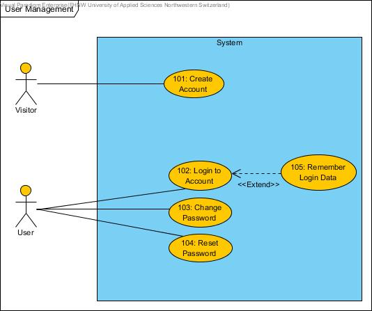
- UC 101: A user must be able to create an account consisting of username password and email address.
- UC 102: A user must be able to login to the account once it was created.
- UC 103: A user should be able to change the password of the account.
- UC 104: A user should be able to change the password of the account in case it is forgotten.
- UC 105: A system should provide a remember me function, that automatically logs in a user after a field was checked in the login window.

#### Module Management:

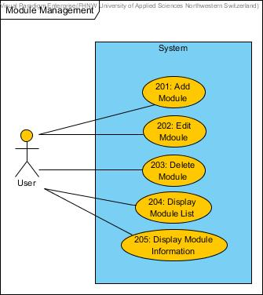
- UC 201: A user must be able to add a module to the modules list. A module must consist of a name, a description and a field that shows the number of credits the module yields.
- UC 202: A user must be able to edit her or his modules.
- UC 203: A user must be able to delete her or his modules.
- UC 204: A user must be able to see a list of all the modules that have been added to the database.
- UC 205: A user should be able to see detailed information about a module. In savvy this is achieved by clicking the discuss button which also shows the comments.

#### Commenting:

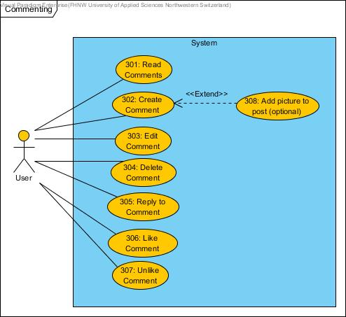
- UC 301: The user must be able to read comments posted about a module.
- UC 302: The user must be able to create a comment for a module.
- UC 303: The user must be able to edit comments the user created.
- UC 304: The user must be able to delete comments the user created.
- UC 305: The user must be able to edit comments the user created.
- UC 306: The user should be able to reply to a comment.
- UC 307: The user should be able to like a comment.
- UC 308: A user should be able to add a picture to a comment.

#### Module Selection:


- UC 401: A user must be able to inscribe into a module.
- UC 402: A user must be able to see the modules the user has inscribed into.
- UC 403: A user should be able to see the total of ECTS achieved with the selected modules.
- UC 404: A user should be able to create a PDF page of the modules the user selected.

## Design
### Mockups
The following picture shows the *login* screen of savvy:

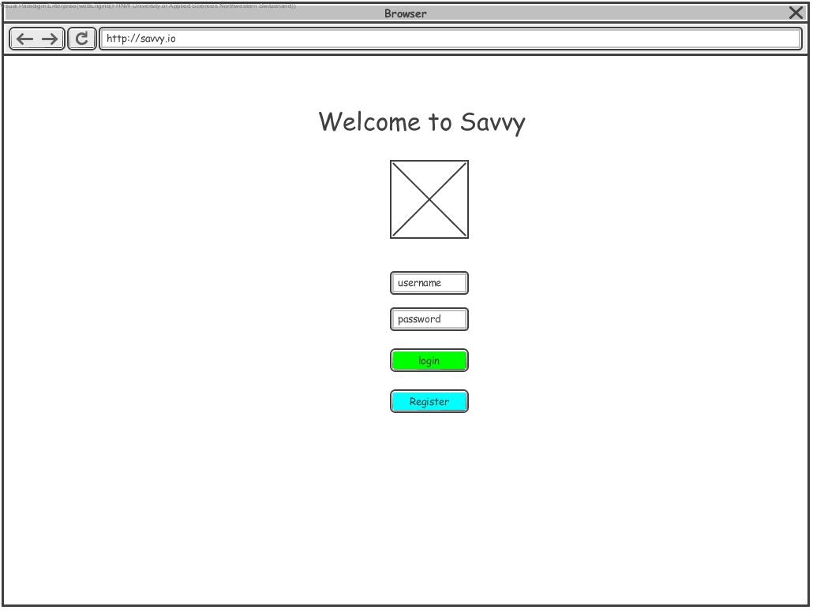

The following picture shows the page where the users can create a *comment* about a module:

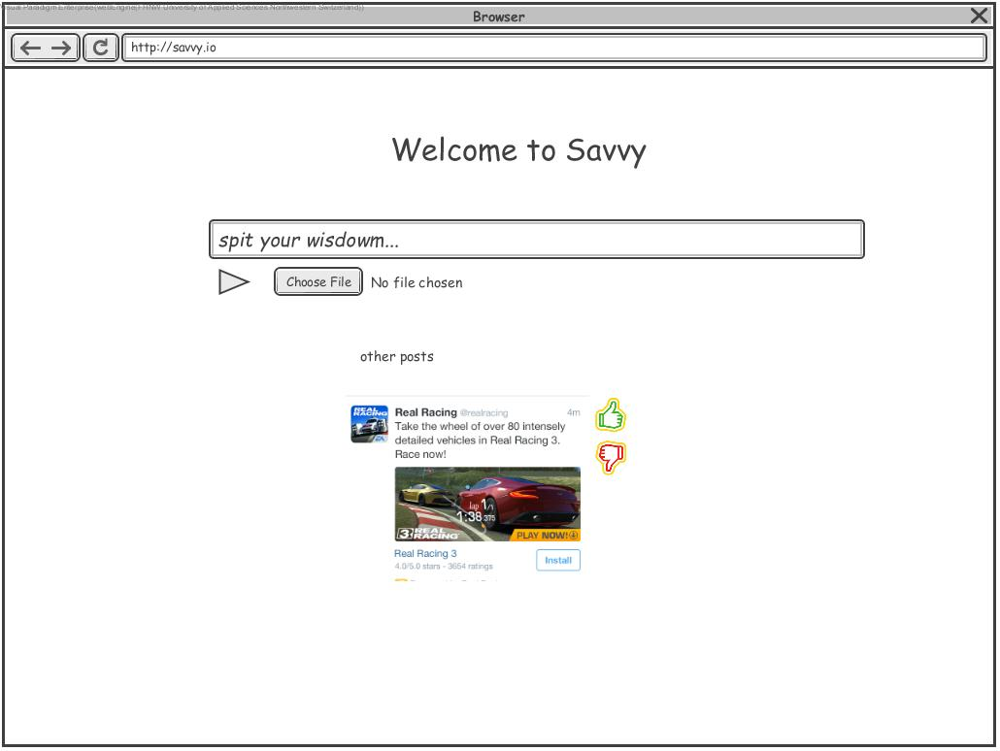

### Entity Relationship Diagram
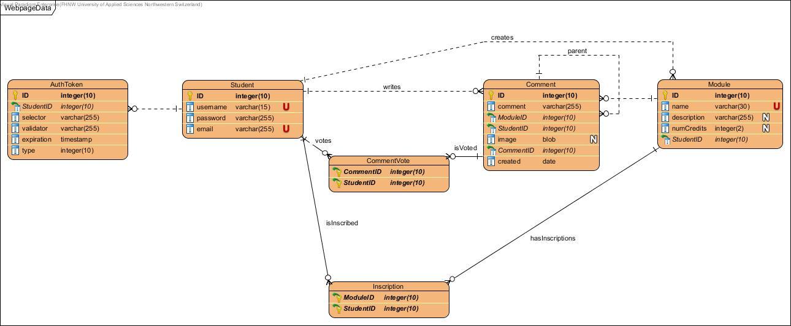
### Domain Model
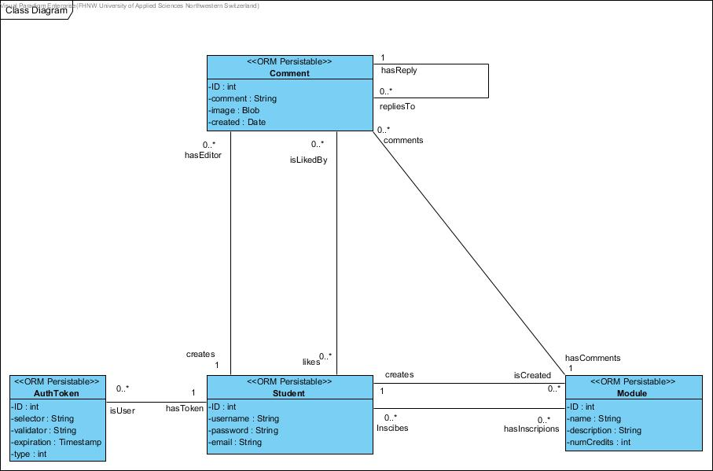
### Data Access Model 
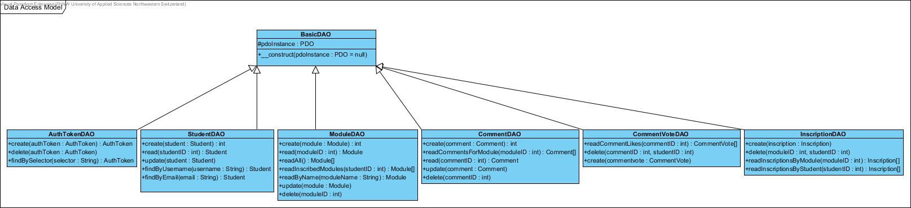
### Busines Logic Model
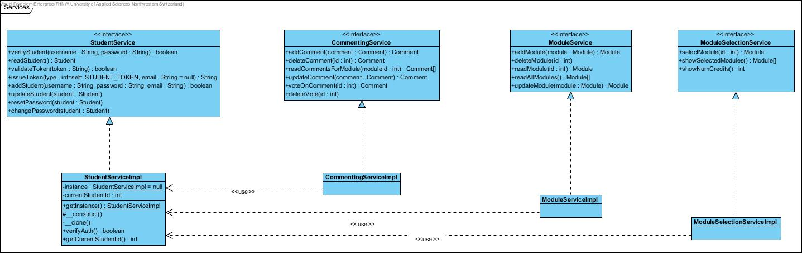
### Layering Structure
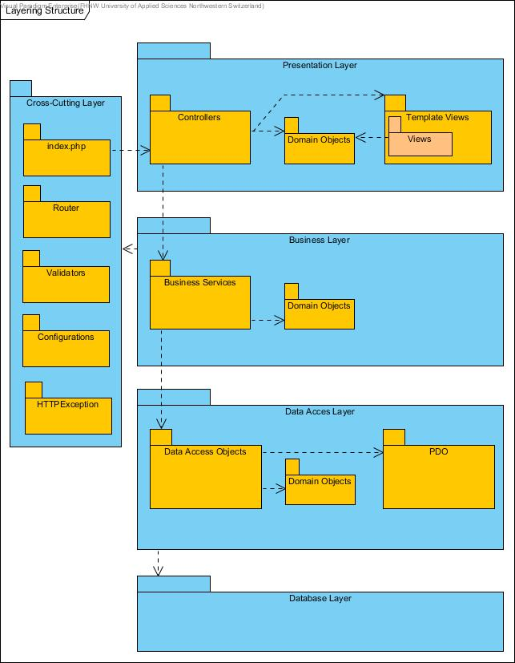 	

## Implementation
### Step 1 : Structure (Ali)
For this project, we have used a framework that offered by our lecturer Andreas Martin (@andreasmartin) with little adaptations. a detailed description of the framework can be found at https://github.com/andreasmartin/WE-CRM 

### Step 2 : Autoloader and Routing (Ali / Kevin)
In this step, the routing was created.
- Created Autoloader using the methods suggested by our lecturer Andreas Martin. (Ali)
- Created Router and Routing Expeption files using the framework suggested by our lecturer Andreas Martin. (Kevin)
- Added corresponding routes to the index.php file.(Kevin)
- "Get" routes were mainly used for loading pages only while "post" requests were used when data had to be sent to the server.(Kevin)
- For routes, that requires the user to be logged in, a validation was added in order to prevent unauthorized access. (Kevin)
### Step 3 : Database (Kevin)
The database was created using the following code:
```SQL
CREATE TABLE Student (
  ID       SERIAL NOT NULL, 
  username varchar(15) NOT NULL UNIQUE, 
  password varchar(255) NOT NULL, 
  email    varchar(255) NOT NULL UNIQUE, 
  PRIMARY KEY (ID));
CREATE TABLE Comment (
  ID        SERIAL NOT NULL, 
  comment   varchar(255) NOT NULL, 
  ModuleID  int4 NOT NULL, 
  StudentID int4 NOT NULL, 
  image     bytea, 
  CommentID int4 NOT NULL, 
  created   date NOT NULL, 
  PRIMARY KEY (ID));
CREATE TABLE CommentVote (
  CommentID int4 NOT NULL, 
  StudentID int4 NOT NULL, 
  PRIMARY KEY (CommentID, 
  StudentID));
CREATE TABLE Inscription (
  ModuleID  int4 NOT NULL, 
  StudentID int4 NOT NULL, 
  PRIMARY KEY (ModuleID, 
  StudentID));
CREATE TABLE AuthToken (
  ID         SERIAL NOT NULL, 
  StudentID  int4 NOT NULL, 
  selector   varchar(255) NOT NULL, 
  validator  varchar(255) NOT NULL, 
  expiration timestamp NOT NULL, 
  type       int4 NOT NULL, 
  CONSTRAINT ID 
    PRIMARY KEY (ID));
CREATE TABLE Module (
  ID          SERIAL NOT NULL, 
  name        varchar(30) NOT NULL UNIQUE, 
  description varchar(255), 
  numCredits  int4, 
  StudentID   int4 NOT NULL, 
  PRIMARY KEY (ID));
ALTER TABLE CommentVote ADD CONSTRAINT isVoted FOREIGN KEY (CommentID) REFERENCES Comment (ID);
ALTER TABLE Comment ADD CONSTRAINT FKComment524391 FOREIGN KEY (ModuleID) REFERENCES Module (ID);
ALTER TABLE CommentVote ADD CONSTRAINT votes FOREIGN KEY (StudentID) REFERENCES Student (ID);
ALTER TABLE AuthToken ADD CONSTRAINT FKAuthToken902530 FOREIGN KEY (StudentID) REFERENCES Student (ID);
ALTER TABLE Inscription ADD CONSTRAINT hasInscriptions FOREIGN KEY (ModuleID) REFERENCES Module (ID);
ALTER TABLE Comment ADD CONSTRAINT writes FOREIGN KEY (StudentID) REFERENCES Student (ID);
ALTER TABLE Inscription ADD CONSTRAINT isInscribed FOREIGN KEY (StudentID) REFERENCES Student (ID);
ALTER TABLE Module ADD CONSTRAINT creates FOREIGN KEY (StudentID) REFERENCES Student (ID);
ALTER TABLE Comment ADD CONSTRAINT parent FOREIGN KEY (CommentID) REFERENCES Comment (ID);

```
### Step 4 : Database Access and Domain Objects (Kevin)
In this step, the DAO objects have been created. The database was accessed using PDO functionality.
- Created classes and methods required for accessing the database.
- Created SQL statements for adding, editing, deleting or loading data from the database. (These statements can be discovered in the classes inside the DAO folder)
- Implemented these statements into the PDO environment.
- Created domain objects to hold the data retrieved from the database.
- Added getters, setters and other required methods (e.g. calculate likes of comment) to domain objects.

### Step 5 : Business Services (Ali / Kevin)
In this step, the services have been created. All the services correspond to a use case.
- Created a service class for every use case group. (Kevin)
- Added a method for every use case. (Kevin)
- Implemented basic business functionality to the methods (Retrieve/edit/add/delete data from DAO). (Kevin)
- Added functionality to hash entries where necessary (storing passwords etc.) (Kevin)
- Added backend functionality to calculate credits.(Kevin/Ali)
- The student management services were implemented using methods suggested by our lecturer Andreas Martin. (Hashing/AuthTokens)(Kevin)

### Step 6 : Register/Login frontend (Ali / Kevin)
In this step, the frontend of the register and the login functionality have been created.
- Created a static login and register pages using Bootstrap Studio. (Ali)
- Added pages to PHP project and converted them into php files. (Ali)
- Added dynamic entries, such as possible error messages, with PHP. (Kevin)
- Created corresponding routes and added required methods to the StudentController class. (Kevin)
- Filled methods to read, add, update or delete Authtoken and Student entries using business services in StudentServiceImpl class. (Kevin)
- Created StudentValidator class that prevents user from entering invalid or malicious data when registering. (Kevin)
- Added a remember me function that creates a cookie on the users computer and keeps them logged in when accessing the page again. (Kevin)

### Step 7 : Module view frontend (Kevin / Ali)
In this step, the frontend for the module management has been created.
- Created static HTML pages for viewing modules using Bootstrap Studio. (Ali)
- Created static HTML pages for adding and editing modules. (Kevin)
- Added pages to PHP project and converted them into php files. (Ali)
- Added dynamic entries to the addModule.php and editModule.php files, such as error messages. (Kevin)
- Added dynamic entries to the main.php file, such as modules list, edit or delete buttons. (Ali)
- Created corresponding routes and added the required methods to the ModuleController class. (Kevin)
- Filled these controller methods with instructions which business services in ModuleServiceImpl to execute, which validations to do and which pages to load. (Kevin)
- Created ModuleValidator class that prevents users from entering invalid or malicous data when creating or editing a module. (Kevin)

### Step 8 : Comementing Functionalty (Ali)
- for every module, there is a commenting section attached to it. For this functionality, we have used a javascript framework called jquery comments with alot of adaptations to it. the user interface provides ajax callbacks that communicate with our server and our postgre database.
- Each comment is a json object that consist of the following attributes: 
  -  "id": a unique ID for each comment on each module
 -   "parent": if a comment is a reply on another comment, then the orginal comment is its parent. 
 -   "created": creation date of a comment
 -   "modified": modification date of a comment
 -   "content": the content of a comment. 
-    "creator": it student ID of the writer of a comment
   - "fullname": the name of the comment writer ( taken from the ID) 
  -  "profile_picture_url": at the moment all the commenters has the same picture, for later improvment, we can allow users to upload their own pictures. "https://app.viima.com/static/media/user_profiles/user-icon.png"
   - "created_by_current_user":if true, then the comment name becomes "You" instead of the current student name.
  -  "upvote_count": the amount of upvotes a comment receive. 
  -  "user_has_upvoted": each user is only allowed to upvote once on a comment, so this is to make sure he or she doesn't upvote twice.
  -  "is_new": a comment is new if it was written in the last 24 hours. 
   
   
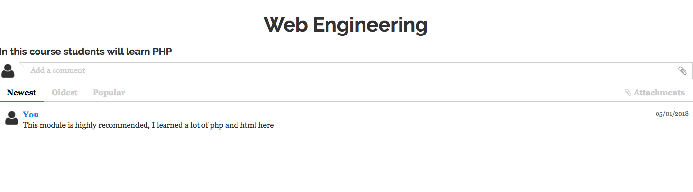
all comments show the data, weather they are new or not ( anything written in less than 24 hours is new) and the person who wrote them. 
- only users who wrote a comment can delete it. 
- a comment that has replies can't be deleted. 
- replies use the orginal comment as a parent 
- the UI asks for confirmations (JS) before deleting a comment to prevent deletion by mistake
- responsive UI that uses ajax calls make it extremly user friendly 
- possiblity to add attachments functionality in the future. 

### Step 9 : Module Selection frontend (Ali)
- every Module has a check box to be added to the current student list
- a student can as many modules as he or she wants
- an automatic calculations of ECTS take place on the server side for the modules registerd. 
- Each module show the amount of students registerd in each module.

### Step 10 : PDF creation (Ali)
- for pdf creattion we have used an open-source tool called fpdf
- a dynamic pdf will be generated that contains all the modules a student selected ( currently or in total) 
- a student can print his or her selected modules directly from the browser.
- Future improvment: add the amount of credits to the list

### Step 11 : Email Service (Ali / Kevin)
In this step, the email service was created that is responsible to send emails when users have forgotten their passwords.
- Created an account on [sendgrid](https://sendgrid.com).(Ali)
- Retrieved an API key.(Ali)
- Created the EmailService class which will be responsible to treat email sending requests. (Kevin)
- Created an email template for all emails the website will send. (Kevin)
- Created a method that fills and sends the email template in case a user resets the password. The emails were send using the method described in the [sendgrid documentation](https://sendgrid.com/docs/index.html). (Kevin)
- The reset-Email sends a link with a random get-argument to the website where the user can proceed to change the password. (Kevin)
- Created static pages needed for password reset using based on the login.php page. (Kevin)
- Added dynamic entries, such as error messages, using PHP. (Kevin)

### Step 12 : Misc (Kevin / Ali)
In this step some missing pages were added.
- Created *contact us* us form. (Ali)
- Created an email account for a savvy admin. (Kevin)
- Created a method in the EmailService class to send the *contact us* request to the savvy email address. (Kevin)
- Added a license agreement. (Kevin)

## Deployment
The system was deployed on the PaaS platform heroku. It can be accessed with the following URL:


[savvy-website](https://savvy-fhnw.herokuapp.com/)

The source code of the website can be found in this repository. The project contains a .gitignore file which ignores certain files. In order to make the source code work a config.env file has to be added to the config folder that contains the database credentials as well as the sendgrid API key. The deployed application has stored these values in the heroku configuration.

## Authors
- Ali Habbabeh
- Kevin Neuschwander

