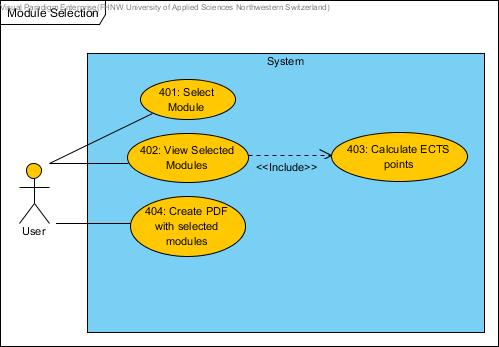

# SAVVY - Web Engineering Project
## Analysis
### Scenario

Savvy is an online service where that students can use for module management. FHNW students can go to 
savvy&#8209;fhnw.herokuapp.com and choose what topics they want to take, calculate their points and post their thoughts about a specific topic. Other users can like this post to make it reach to the top of a specific topic or to the bottom.

### Requirements

- Users must be able to login using a username and a password.
- The system shall provide a remember me function for login data.
- If the password is forgotten, it should be possible to get a new one using email.  
- The password must be securely stored.  
- There must be a database to store modules, comments and users.
- The system should provide a list of comments that where posted about a specific topic. 
- Users should be able to like comments.
- Users must have the ability to edit and delete their own posts.
- Users must be able to create modules including a name, a descirption and a value for the number of credits.
- Users must be able to update and delete the modules they have added.
- The system shall provide the user with the information how many users have inscribed into a module.
- The system shall be able to calculate the total of the ECTS points of all modules a user has selected.
- (Optional) Users should have the ability to post images as a comment.
- (Optional) Create PDF files from chosen topics.

### Use Cases
The use cases were divided into four groups.

User Management:


Module Management:


Module Selection:



Commenting:


## Design
### Mockups
The following picture shows the *login* screen of savvy:


The following picture shows the page where the users can create a *comment* about a module:


### Entity Relationship Diagram

### Domain Model

### Data Access Model 

### Busines Logic Model

### Layering Structure
 	

## Implementation
### Step 1 : Structure
### Step 2 : Routing
### Step 3 : Database
The database was created using the following code:
```SQL
CREATE TABLE Student (
  ID       SERIAL NOT NULL, 
  username varchar(15) NOT NULL UNIQUE, 
  password varchar(30) NOT NULL, 
  email    varchar(255) NOT NULL UNIQUE, 
  PRIMARY KEY (ID));
CREATE TABLE Comment (
  ID        SERIAL NOT NULL, 
  comment   varchar(255) NOT NULL, 
  ModuleID  int4 NOT NULL, 
  StudentID int4 NOT NULL, 
  image     bytea, 
  CommentID int4 NOT NULL, 
  created   date NOT NULL, 
  PRIMARY KEY (ID));
CREATE TABLE CommentVote (
  CommentID int4 NOT NULL, 
  StudentID int4 NOT NULL, 
  PRIMARY KEY (CommentID, 
  StudentID));
CREATE TABLE Inscription (
  ModuleID  int4 NOT NULL, 
  StudentID int4 NOT NULL, 
  PRIMARY KEY (ModuleID, 
  StudentID));
CREATE TABLE AuthToken (
  ID         SERIAL NOT NULL, 
  StudentID  int4 NOT NULL, 
  selector   varchar(255) NOT NULL, 
  validator  varchar(255) NOT NULL, 
  expiration timestamp NOT NULL, 
  type       int4 NOT NULL, 
  CONSTRAINT ID 
    PRIMARY KEY (ID));
CREATE TABLE Module (
  ID          SERIAL NOT NULL, 
  name        varchar(30) NOT NULL UNIQUE, 
  description varchar(255), 
  numCredits  int4, 
  StudentID   int4 NOT NULL, 
  PRIMARY KEY (ID));
ALTER TABLE CommentVote ADD CONSTRAINT isVoted FOREIGN KEY (CommentID) REFERENCES Comment (ID);
ALTER TABLE Comment ADD CONSTRAINT FKComment524391 FOREIGN KEY (ModuleID) REFERENCES Module (ID);
ALTER TABLE CommentVote ADD CONSTRAINT votes FOREIGN KEY (StudentID) REFERENCES Student (ID);
ALTER TABLE AuthToken ADD CONSTRAINT FKAuthToken902530 FOREIGN KEY (StudentID) REFERENCES Student (ID);
ALTER TABLE Inscription ADD CONSTRAINT hasInscriptions FOREIGN KEY (ModuleID) REFERENCES Module (ID);
ALTER TABLE Comment ADD CONSTRAINT writes FOREIGN KEY (StudentID) REFERENCES Student (ID);
ALTER TABLE Inscription ADD CONSTRAINT isInscribed FOREIGN KEY (StudentID) REFERENCES Student (ID);
ALTER TABLE Module ADD CONSTRAINT creates FOREIGN KEY (StudentID) REFERENCES Student (ID);
ALTER TABLE Comment ADD CONSTRAINT parent FOREIGN KEY (CommentID) REFERENCES Comment (ID);

```
### Step 4 : Database Access
### Step 5 : Services
### Step 6 : Register/Login frontend
### Step 7 : Module view frontend
### Step 8 : Comementing frontend
### Step 9 : Module Selection frontend
### Step 10 : PDF creation


## Deployment
The system was deployed on the PaaS platform heroku. It can be accessed with the following URL:


[savvy](https://savvy-fhnw.herokuapp.com/)

